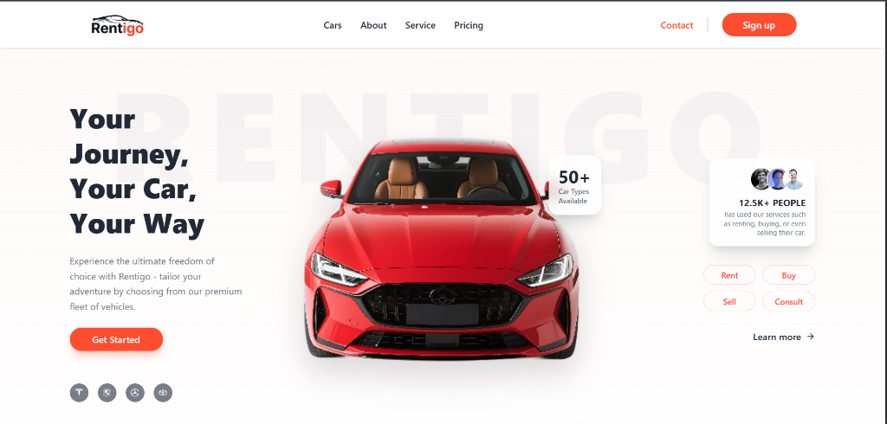
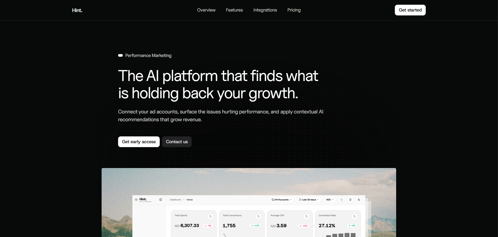
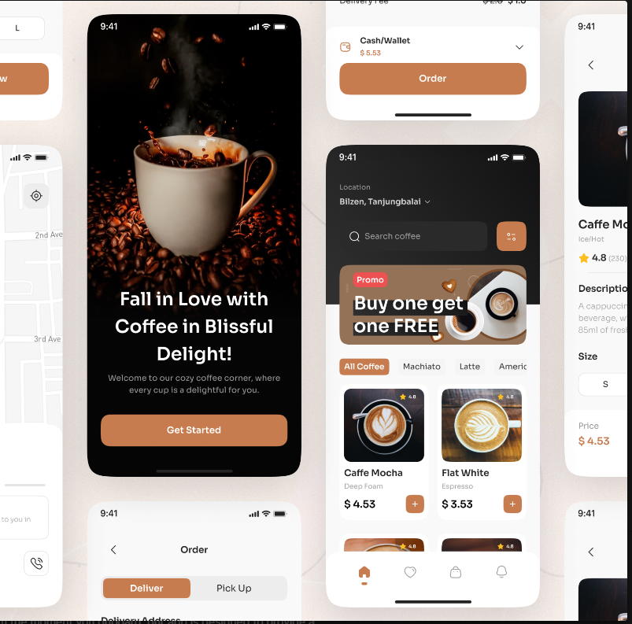

<p align="center">
  
</p>

<p align="center">
  
</p>

<h1 align="center">Abdul Rehman Codes — abdulrehmancodes (abdulrehmancodesx)</h1>

<p align="center">
  <b>Full-Stack MERN Developer • n8n Workflow Automation Specialist • WordPress &amp; Shopify Customizer</b>
</p>

<p align="center">
  Welcome to the official GitHub profile of <b>Abdul Rehman</b> (known online as <b>abdulrehmancodes</b> and <b>abdulrehmancodesx</b>). I build high-performance web applications, automated business workflows, responsive cross-platform mobile apps, client dashboards, and custom eCommerce solutions that streamline operations and drive digital growth.
</p>

<p align="center">
  <a href="https://abdulrehmancodes.site" target="_blank">
    
  </a>
  <a href="https://www.linkedin.com/in/abdulrehmancodesx/" target="_blank">
    
  </a>
  <a href="https://github.com/abdulrehmancodesx" target="_blank">
    
  </a>
  <a href="https://www.instagram.com/abdulrehmancodes/" target="_blank">
    
  </a>
  <a href="mailto:abdulrehmancodes06@gmail.com">
    
  </a>
  
</p>

<p align="center">
  
</p>

## ⚡ Proof-Backed Builds

<a href="https://finalyearproject-delta.vercel.app/">
  
</a>

### 🚗 Rentigo — AI-Integrated Smart Car Rental System

An intelligent, high-concurrency booking ecosystem engineered to eliminate vehicle reservation conflicts while generating custom recommendation weights.

<p>
  
  
  
  
  
</p>

* **Core Challenge:** Re-engineering booking event loops to prevent database race conditions during peak reservation windows.
* **Technical Solution:** Integrated automated background cron tasks in n8n to monitor reservation constraints, sync active fleet listings, and trigger webhook notifications.
* **Architecture:** Programmed Express.js endpoint routing backed by secure JWT validation and Stripe payment checkout relays.

---

<a href="https://hint.fyi/">
  
</a>

### 📈 Hint — AI-Powered Marketing &amp; Ads Analytics Platform

A dashboard that aggregates high-volume advertising account data streams and normalizes conversion, CPA, and spending metrics.

<p>
  
  
  
  
</p>

* **Core Challenge:** Aggregating diverse high-volume advertising stream hooks without violating third-party API rate limitations.
* **Technical Solution:** Built custom n8n workflow listeners and API handlers to ingest metrics in real-time, executing background server tasks and alert structures.
* **User Interface:** Developed sleek Tailwind dark mode panels showing sanitized charts, spend indicators, and conversion tables.

---

<a href="https://github.com/abdulrehmancodesx/Coffee_Shop">
  
</a>

### ☕ Coffee Shop — React Native Coffee E-Commerce App

A cross-platform mobile shopping application supporting smooth UI animations, cart management, and async persistence.

<p>
  
  
  
  
  
</p>

* **Core Challenge:** Maintaining consistent rendering alignments and smooth layout gestures on both iOS and Android platforms simultaneously.
* **Technical Solution:** Compiled NativeWind modules inside an Expo build pipeline to manage utility styles across native interfaces.
* **Key Features:** Implemented async-storage database tracking for persistent orders, category selection filters, and client rating triggers.

<p align="center">
  
</p>

## 🧠 Premium Systems I Build

<table>
<tr>
<td width="50%">

### Full-Stack Web Applications

I engineer scalable web platforms using the MERN stack (React, Node, Express, MongoDB) featuring polished layouts, JWT authentication, and solid cloud deployment flows.

</td>
<td width="50%">

### n8n Workflow Automation

I design automated workflow pipelines, configure webhook relays, trigger alerts (Slack, Discord, Email), maps third-party APIs, and schedule background script runs.

</td>
</tr>
<tr>
<td width="50%">

### Cross-Platform Apps

I compile responsive native mobile apps using React Native and Expo, building client state architectures that synchronize locally and load components instantly.

</td>
<td width="50%">

### WordPress &amp; Shopify Sites

I customize e-commerce storefronts, design landing pages, integrate secure checkout gates, optimize SEO/performance, and connect store backends with custom inventory syncs.

</td>
</tr>
</table>

## 🛠️ Tech Stack

<p align="center">
  
</p>

<p align="center">
  
  
  
  
  
  
  
  
  
  
</p>

## 📊 GitHub Performance

<p align="center">
  
  
</p>

<p align="center">
  
</p>

## 📈 Contribution Activity

<p align="center">
  
</p>

## 🐍 Contribution Snake

<p align="center">
  
</p>

## 🚀 Current Focus

```txt
Building scalable MERN stack web applications, configuring robust n8n workflow integrations,
developing cross-platform React Native apps, and automating server-side background tasks.
```

<p align="center">
  <a href="https://abdulrehmancodes.site" target="_blank">
    
  </a>
  <a href="https://www.linkedin.com/in/abdulrehmancodesx/" target="_blank">
    
  </a>
  <a href="https://www.instagram.com/abdulrehmancodes/" target="_blank">
    
  </a>
  <a href="https://wa.me/923225547677" target="_blank">
    
  </a>
  <a href="mailto:abdulrehmancodes06@gmail.com">
    
  </a>
</p>

<p align="center">
  
</p>

<p align="center">
  <b>abdulrehmancodes / abdulrehmancodesx</b> — Building web applications and automated workflows that scale.
</p>
